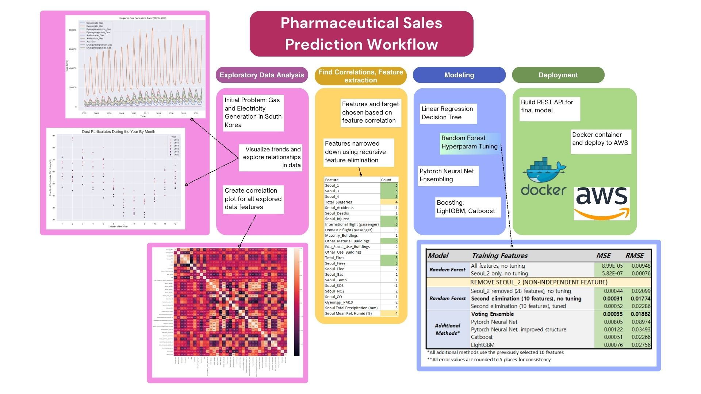

# Capstone: Predicting Pharmaceutical Sales in South Korea
### Analyze data, make connections, train and test models, and deploy! 

Following the tumultuous age of COVID-19 and the resulting restructuring and restoration of modern society, medical data and its potential predictive qualities have become increasingly valuable for studies of disease and disease control, medical procedures, travel, and more. 

This project aims to take a deeper look at some potential predictors for the total sales of pharmaceutical drugs in South Korea, analyzing data from different sectors of Korean society. The goal is therefore to find connections between these varying sources of data and use them to accurately predict Korean drug sales. 

**Note**: The final model will use a REST API and Docker container to be deployed to the web. The model used in this step will be pre-trained based on the 'Preprocessed_Data' available in the file. This means that currently additional training is not possible through the web, but can instead be added in a later implementation. 

The process can be simplified to the following workflow:
 Initial idea and data -> Analyze for connections -> Extract features -> Modeling and model evaluation -> Model deployment

## Project Overview:
<ins>Problem:</ins> Predict drug sales in Korea using data from various facets of South Korean life, including (but not limited to): weather, healthcare, travel, building construction, etc.
  <ins>Topics:</ins> 
* Data analysis: EDA and feature extraction; recursive feature elimination and correlation studies
* Modeling: Basic regressors, tree-based algorithms, neural networks, ensembling, boosting
* Metric evaluation and analysis; optimization and best-model selection
* Model Deployment: create REST API for the final model, containerize and push to Docker container for deployment

## Folder Hierarchy - A quick explanation of the files
This project contains the entire process of finding a potential problem, collecting data, exploring said data, and modeling. Thus, it can be quite a winding journey to look through! Here is a quick explanation of the files and folders. Bolded files have the most impact/final conclusions; check those out for the most condensed view of this project.

### Jupyter notebook files
There are 3 jupyter notebooks, each serving a different purpose for the project.
* Korea Gas and Electricity Comprehensive EDA - initial data exploration and drawn conclusions (exploring correlations and potential project problems)
* Modeling - First look at potential models. The original project problem centered around gas and electricity generation, so this notebook explores that aspect of the data.
* __Pharm_Modeling__ - Final modeling notebook: this modeling was done after defining the final project problem, and explores various models to find a best fit for this situation and data.

### /Data
There were many sources of data used for exploration in this project, but not all are necessarily relevant to the final models. There are a few key files to look at:
* __Preprocessed_Data__ - processed data used for final model
* Korea_Data_All - less cleaned version of final data; contains explored features from throughout the project. Different sheets are used for different parts of the project.
Other data files are used for data exploration or for presentation purposes.

### /Pharm_Deploy
This folder contains deployment files for this project. It uses a pickled model to build a Flask REST API, containerizes it with Docker, and is sent to an AWS instance to be hosted. See the contained README for more information and instructions.

## How to view the project
The project is largely explained through in-depth documentation in Jupyter notebook files. The environment used for modeling and data exploration is not included in the project files as of now, due to the large scale of libraries used throughout the project.

Instead, check out /Pharm_Deploy for deployment instructions, including how to set up the environment and reproduce the results. 

Access the model: 
 [Initial project proposal](https://docs.google.com/document/d/1n_RRZgfwl0WT2p3aCEYIY8RU9nsb2mGosM1jT3U_WT0/edit)
 [Full project write-up](https://docs.google.com/document/d/10khUmjzLq3PH_gnmZfJjBF86JT7S8hG7s1BtfL9th5A/edit)

