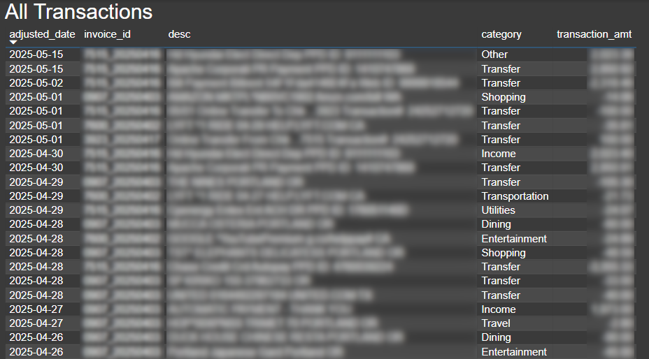

# Financial Invoice Parser💸📈

## Automated PDF Invoice Processing System for Financial Transactions

<div align="center">
    
    
</div>

Managing financial statements and invoices can be tedious and error-prone. This project provides an automated solution for extracting, categorizing, and storing financial data from PDF bank statements and credit card invoices.

## Project Overview
**Problem:** Process financial statements (banking and credit card) automatically to extract transaction details and categorize spending for better financial management.

<div align="center">
    
</div>

### Features:
* **PDF Parsing**: Extracts data from multiple types of financial documents
* **Intelligent Recognition**: Automatically identifies statement types (bank or credit card)
* **Transaction Extraction**: Parses line items with dates, descriptions, and amounts
* **LLM-Powered Categorization**: Uses AI to categorize transactions based on descriptions
* **Persistent Storage**: Maintains financial data in an SQLite database
* **Visualization Ready**: Export data for use with Power BI or other visualization tools

## Technical Implementation

The system uses a combination of technologies to deliver its functionality:

* **PDF Processing**: PyPDF and PyMuPDF for text extraction
* **Data Manipulation**: Pandas for structured data handling
* **AI Categorization**: LangChain integration with Ollama for local LLM transaction categorization
* **Data Storage**: SQLite for lightweight database management
* **Logging**: Comprehensive logging system for tracking operations

## Usage

```bash
# Install dependencies
pip install -r requirements.txt

# Run the parser
python invoiceParser.py

# Note: you must have Ollama set up on your local device to run categorization. 
# See docs: https://github.com/ollama/ollama
# Alternatively, you may edit utils/category_llm.py with your own LLM.
```

## Workflow

1. PDF invoices are automatically detected and parsed
2. Statement information and transactions are extracted
3. Data is stored in a structured SQLite database
4. Transactions are categorized using AI (Groceries, Dining, etc.)
5. User reviews and approves AI categorizations before they're committed
6. Data can be exported for visualization in Power BI

## Data Model

The system maintains three primary tables:
* `bank_summary`: Overview of bank statement information
* `card_summary`: Overview of credit card statement information
* `transactions`: Individual transaction details with categories

## LLM-Based Categorization

Transaction categorization is performed using a local LLM through Ollama:

* Implementation in `utils/category_llm.py`
* Uses LangChain to communicate with local Llama3 model
* Prompt-based approach for consistency in categorization
* Transactions are categorized into predefined categories (Groceries, Dining, etc.)
* User reviews and approves categorizations before database updates

## Future Enhancements

* Enhanced visualization dashboards
* Multi-currency support
* Budget tracking and alerts
* Tax preparation helpers
* Machine learning for anomaly detection
* Upgrade LLM for more accurate categorization

---

*Version 1.1 - Added LLM-generated transaction categorization*