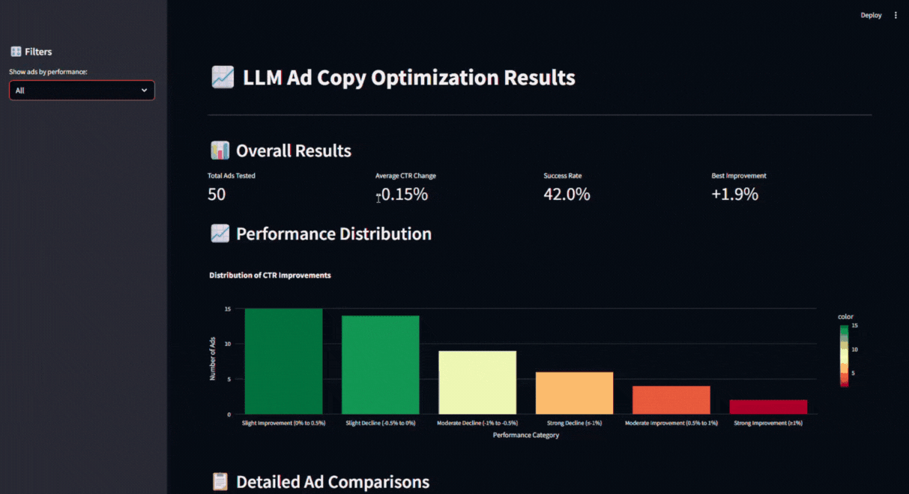
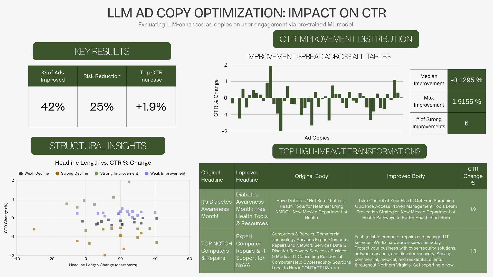

# LLM Ad Copy Optimizer 📈✨

<div align="center">
    
</div>

## AI-Powered Ad Copy Optimization Using ML + LLM

Writing high-performing ad copy is both an art and a science. This project combines machine learning CTR prediction with LLM-powered generation to automatically improve advertising copy. Train a model on historical ad performance, then use AI to rewrite underperforming ads with data-driven optimization strategies.

## 📌 Project Overview

**Goal:** Predict ad performance using ML, then leverage LLM generation to create optimized ad copy that scores higher on the trained CTR model.

### 🚀 Features

* **Meta Ad Library Integration**: Fetch real ads via Meta's Ad Archive API
* **LLM Data Enrichment**: Transform raw ad text into structured datasets using Ollama
* **Comprehensive Feature Engineering**: 30+ text, categorical, and performance features
* **CTR Prediction Model**: Random Forest regressor with hyperparameter tuning and overfitting validation
* **AI-Powered Ad Rewriting**: Generate improved headlines and body copy using Claude or Ollama
* **ML-Guided Optimization**: LLM prompts incorporate model insights and feature importance
* **Evaluation Pipeline**: Compare predicted CTR for original vs. improved versions
* **Interactive Dashboard**: Streamlit app for visualizing optimization results

## 📊 Results

<!-- Add results visualization here -->
<div align="center">
    
</div>

📥 **[Download Full Detailed Results (Excel)](data/LLM_Ad_Optimization_Detailed_Results.xlsx)**

## 🏗️ Technical Implementation

The system combines traditional ML with modern LLM capabilities:

* **Data Pipeline**: Meta Ad Library API → LangChain + Ollama for data enrichment
* **Feature Engineering**: Custom `AdCopyFeatureEngineer` class with text analysis, pattern detection, categorical encoding
* **ML Model**: scikit-learn Random Forest with GridSearchCV tuning, data leakage prevention
* **LLM Integration**: Anthropic Claude API or local Ollama models via LangChain
* **Prompt Engineering**: Dynamic prompts based on headline length, category, and model feature importance
* **Visualization**: Streamlit + Plotly for interactive results exploration

## 📁 Project Structure

```
llm_ad_copy_optimizer/
├── README.md                    # Project documentation (this file)
├── Dockerfile                   # Container configuration
├── data/
│   ├── sample_ads.csv           # Raw ad copy data
│   ├── enriched_ads_with_metrics.csv
│   ├── ml_ready_ad_features.csv
│   ├── pipeline/                # Intermediate pipeline outputs
│   └── stage/                   # Chunked processing files
├── models/
│   ├── ctr_predictor_production.joblib
│   └── ctr_predictor_overfit.joblib
├── notebooks/
│   ├── 01_exploration-raw.ipynb
│   ├── 02_enrich-dataset.ipynb
│   ├── 03_exploration-enriched.ipynb
│   ├── 04_feature-engineering.ipynb
│   ├── 05_modeling.ipynb
│   ├── 06_generation-evaluation.ipynb
│   └── 07_results-presentation.ipynb
├── source_code/
│   ├── README.md                # Technical documentation
│   └── app/
│       ├── app.py               # Streamlit dashboard
│       ├── build_ad_dataset.py  # Meta API data fetching
│       ├── compute_metrics.py   # Performance metric calculation
│       ├── features.py          # Feature engineering pipeline
│       ├── model.py             # CTR prediction model
│       └── generator.py         # LLM ad copy generator
└── graphics/                    # Project images and diagrams
```

## 📖 Usage

### Environment Setup

```bash
# Clone the repository
git clone https://github.com/yourusername/llm_ad_copy_optimizer.git
cd llm_ad_copy_optimizer

# Install dependencies
pip install -r requirements.txt

# Set up environment variables
# Create a .env file in source_code/app/ with:
#   ANTHROPIC_API_KEY=your_key_here
#   META_ACCESS_TOKEN=your_token_here  (optional, for Meta Ad Library)

# For local LLM (optional)
# Install Ollama and pull a model: ollama pull llama3:8b
```

### Running the Pipeline

```bash
# Run notebooks in order (01-07) for full pipeline
# Or use the modules directly:

cd source_code/app

# Fetch ads from Meta (requires META_ACCESS_TOKEN)
python build_ad_dataset.py

# Add performance metrics
python compute_metrics.py

# Launch results dashboard
streamlit run app.py
```

## ⚗️ Workflow

1. **Data Collection**: Fetch ads from Meta Ad Library or use existing ad copy datasets
2. **Data Enrichment**: LLM parses raw text into structured format (headline, body, CTA, category)
3. **Feature Engineering**: Extract 30+ features from text, categories, and performance metrics
4. **Model Training**: Train Random Forest CTR predictor with cross-validation and tuning
5. **Ad Generation**: LLM rewrites ads using optimization prompts guided by model insights
6. **Evaluation**: Compare predicted CTR for original vs. improved versions
7. **Visualization**: Explore results in Streamlit dashboard

## 🔬 Features Engineered

The ML pipeline extracts multiple feature categories:

* **Text Features**: Character/word counts, capitalization ratio, punctuation patterns
* **Pattern Detection**: Urgency words, positive sentiment, numbers, percentages, discounts
* **Categorical Encoding**: Platform, ad format, category (label + one-hot)
* **Performance Metrics**: CTR, CVR, CPC, CPA, engagement score, cost efficiency
* **Interaction Features**: Text length × CTR, platform-format combinations

## 🤖 LLM Integration

Ad copy generation is powered by Claude or Ollama:

* **Dual Provider Support**: Anthropic Claude API or local Ollama models
* **Dynamic Prompting**: Prompts adapt based on headline length, category, and current performance
* **ML-Guided Optimization**: Feature importance from trained model informs rewrite suggestions
* **Structured Output**: JSON responses with improved headline, body, and reasoning
* **Batch Processing**: Rate limiting and error handling for large-scale generation

<!-- Example metrics to include:
- Average CTR improvement: X%
- Top-performing categories
- Sample before/after comparisons
-->

## 🎯 Future Enhancements

* A/B testing integration for real-world validation
* Multi-objective optimization (CTR + CVR + brand safety)
* Fine-tuned LLM for ad copy domain (specifically RLHF or RLAIF using trained model as evaluator)
* Real-time optimization API endpoint
* Support for additional ad platforms (Google Ads, LinkedIn)
* Image/creative analysis integration

## 📚 Documentation

* **[Source Code README](source_code/README.md)**: Detailed technical documentation for notebooks and modules
* **[Integration Guide](source_code/INTEGRATION.md)**: How to use generator.py and model.py together

---

*AI-powered ad copy optimization combining ML prediction with LLM generation*
