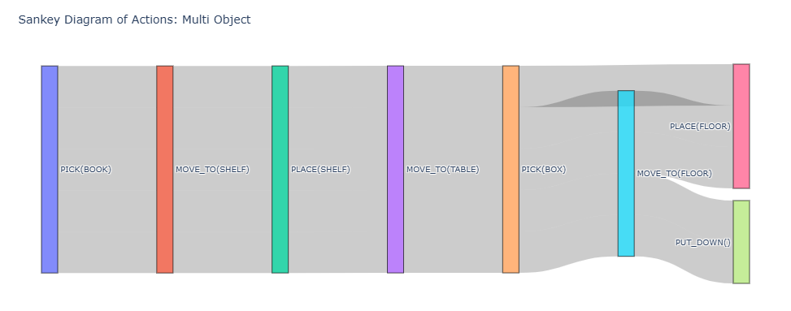

# SymbolicPlan

**LLM Agent for Robot Task Planning with Symbolic Reasoning**

An intelligent planning system that combines Large Language Models (LLMs) with symbolic execution for robot task planning. The agent reasons about actions in natural language and executes them through deterministic symbolic primitives, bridging modern AI with classical robotics planning.

## 🎯 Project Overview

This system demonstrates **agentic reasoning** in a robotics context - a key area in embodied AI research (related to RT-X, ALOHA, and other robotics-AI initiatives). It uses LLMs to make high-level decisions while maintaining reliability through symbolic action execution.

#### Motivation
Robotic systems need the ability to translate high-level goals into structured sequences of actions, yet traditional planners are brittle and hard to generalize. With the rise of LLMs, it’s now possible to leverage natural-language reasoning to generate flexible, human-interpretable plans—while still grounding execution in deterministic, symbolic actions. This project explores that intersection: using an LLM to propose task-level decisions and a symbolic simulator to validate and execute them, demonstrating a lightweight but meaningful example of how modern reasoning models can augment classical robotics planning.

**Key Features:**
- LLM-driven decision making (Anthropic Claude or local Ollama)
- Symbolic action primitives for reliable execution
- Goal-based task completion with validation
- Multiple test scenarios and evaluation metrics
- Clean separation of concerns (agent ↔ environment)

---

## 🏗️ Architecture

```
┌─────────────┐
│  main.py    │  ← Entry point - runs evaluation pipeline
└──────┬──────┘
       │
       ▼
┌─────────────────────────────────────────────┐
│            AGENT LAYER                      │
├─────────────────────────────────────────────┤
│ llm_client.py  → LLM provider switcher      │
│ prompting.py   → Prompt builder & parser    │
│ planner.py     → LLM-based action selector  │
└──────────────────┬──────────────────────────┘
                   │
                   ▼
┌─────────────────────────────────────────────┐
│         ENVIRONMENT LAYER                   │
├─────────────────────────────────────────────┤
│ world.py       → State representation       │
│ actions.py     → Symbolic action primitives │
└─────────────────────────────────────────────┘
       │
       ▼
┌─────────────────────────────────────────────┐
│         EVALUATION LAYER                    │
├─────────────────────────────────────────────┤
│ metrics.py     → Test scenarios & metrics   │
└─────────────────────────────────────────────┘
```

### Component Breakdown

#### **Environment Layer** (`env/`)
- **`world.py`** - Defines world state (robot, objects, goals) with validation and natural language conversion
- **`actions.py`** - 7 symbolic action primitives:
  - `move_to(location)` - Move robot to location
  - `pick(object)` - Pick up object
  - `place(location)` - Place held object at location
  - `put_down()` - Drop held object at current location
  - `inspect(object)` - View object properties
  - `open_container(object)` - Open containers
  - `close_container(object)` - Close containers

#### **Agent Layer** (`agent/`)
- **`llm_client.py`** - Abstraction over LLM providers (Anthropic/Ollama) with unified interface
- **`prompting.py`** - Converts world state to prompts and parses LLM responses into actions
- **`planner.py`** - Main planning loop that orchestrates LLM decisions and action execution

#### **Evaluation Layer** (`eval/`)
- **`metrics.py`** - Test scenarios and evaluation metrics (completion rate, efficiency)

---

## 🚀 Quick Start

### 1. Installation

```bash
# Create virtual environment
python -m venv .venv

# Activate (Windows PowerShell)
.\.venv\Scripts\Activate.ps1

# Activate (Linux/Mac)
source .venv/bin/activate

# Install dependencies
pip install -e ".[dev]"
```

### 2. Configuration

Create a `.env` file from the template:

```bash
cp .env.example .env
```

**For Anthropic Claude:**
```env
LLM_PROVIDER=anthropic
ANTHROPIC_API_KEY=your_api_key_here
```

**For Ollama (Local):**
```env
LLM_PROVIDER=ollama
```

If using Ollama, make sure it's running: `ollama serve`

### 3. Run the Evaluation Pipeline

```bash
python main.py
```

This will run the planner through three test scenarios:
1. Basic pick-and-place with distractor
2. Container manipulation task
3. Multi-object organization task

**Example Output:**
```
Testing basic pick-and-place...
Step 1: Moved to table
Step 2: Picked up box
Step 3: Moved to shelf
Step 4: Placed box on shelf

==================================================
EVALUATION REPORT
==================================================
Episodes Run:       5
Successes:          4
Completion Rate:    80.0%
Avg Steps (All):    4.20
Avg Steps (Success):4.00
==================================================
```

### Sample Results

**Multi-Object Organization Task:**
- **Task:** Place book on shelf and box on floor from table
- **Completion Rate:** 80% (4/5 episodes successful)
- **Average Steps:** 10.0 overall, 8.75 for successful episodes
- **Optimal Steps:** ~6 steps (varies by strategy)

<div align="center">
    
</div>

The system demonstrates robust planning across diverse scenarios with high success rates. See `EVALUATION.md` for detailed analysis of all test scenarios including pick-and-place (100% success) and container manipulation (100% success).

---

## 📖 Usage Examples

### Basic Planner Usage

```python
from dotenv import load_dotenv
from env.world import WorldState, RobotState, ObjectState, Goal
from agent.llm_client import LLMClient
from agent.planner import LLMPlanner

load_dotenv()

# Define initial world state
initial_state = WorldState(
    robot=RobotState(location="table"),
    objects={
        "box": ObjectState(name="box", location="floor"),
    },
    task_description="Move the box to the shelf",
    goals=[
        Goal(type="object_at_location", params={"object": "box", "location": "shelf"})
    ],
    max_steps=10
)

# Create planner with LLM
llm = LLMClient()  # Uses .env configuration
planner = LLMPlanner(llm=llm, max_steps=10)

# Run episode
final_state, success, steps = planner.run_episode(initial_state)
print(f"Task completed: {success} in {steps} steps")
```

### Custom LLM Configuration

```python
# Use specific provider and model
llm = LLMClient(
    provider="anthropic",
    model_name="claude-haiku-4-5"
)

# Or use local Ollama
llm = LLMClient(
    provider="ollama",
    model_name="llama3:2b",
    base_url="http://localhost:11434"
)
```

---

## 🔄 How It Works

The planning loop follows this cycle:

```
1. World state → Natural language description
2. LLM receives state + valid actions
3. LLM outputs next action
4. Parser extracts action + arguments
5. Symbolic action executes (deterministic)
6. World state updates
7. Check goal completion
8. Repeat until done or max steps
```

**Key Design Principles:**
- **Immutable state** - Actions return new states, ensuring reproducibility
- **LLM-agnostic** - Easy provider switching without code changes
- **Symbolic execution** - Deterministic, testable action primitives
- **Natural language interface** - LLM sees human-readable state descriptions

---

## 📊 Evaluation Metrics

The system tracks:
- **Completion Rate** - Percentage of successfully completed tasks
- **Average Steps** - Mean steps across all episodes
- **Success Efficiency** - Average steps for successful episodes only
- **Per-scenario metrics** - Performance on different task types

---

## 🛠️ Tech Stack

- **Python 3.9+**
- **LLMs**: Anthropic Claude API or Ollama (local)
- **Libraries**: `anthropic`, `ollama`, `python-dotenv`, `pydantic`
- **Development**: `pytest`, `black`, `ruff`

---

## 📁 Project Structure

```
SymbolicPlan/
├── agent/              # Agent decision-making layer
│   ├── llm_client.py   # LLM provider abstraction
│   ├── planner.py      # Main planning loop
│   └── prompting.py    # Prompt engineering utilities
├── env/                # Environment simulation
│   ├── actions.py      # Symbolic action primitives
│   └── world.py        # World state representation
├── eval/               # Evaluation and testing
│   └── metrics.py      # Test scenarios and metrics
├── main.py             # Entry point
├── pyproject.toml      # Dependencies and config
├── .env.example        # Environment variable template
└── README.md           # This file
```

---

## 🎓 Portfolio Highlight

This project demonstrates:
- **Agentic AI** - LLM-driven autonomous decision making
- **Embodied AI** - Bridging language models with physical task planning
- **Software Architecture** - Clean separation of concerns, modular design
- **Evaluation Methodology** - Systematic testing with meaningful metrics
- **Modern ML Engineering** - LLM integration, prompt engineering, provider abstraction

Relevant to robotics-AI trends like RT-X, ALOHA, and other embodied intelligence research.

---

## 🔮 Future Enhancements

**Complex Task Scenarios:**
- Multi-room navigation with doorways and obstacles
- Hierarchical task decomposition (e.g., "prepare dinner" → sub-tasks)
- Constraint satisfaction problems (stacking with stability rules)
- Time-dependent goals (e.g., perishable items, battery limits)

**System Improvements:**
- **Replanning** - Handle action failures with dynamic recovery strategies
- **Visual grounding** - Integrate vision models for object detection/state estimation
- **Memory systems** - Add episodic memory for learning from past episodes
- **Human feedback** - RLHF-style corrections to improve planning policies
- **Continuous actions** - Parameterized motion primitives (grasp angles, forces)
- **Uncertainty modeling** - Probabilistic state estimation and risk-aware planning
  
---