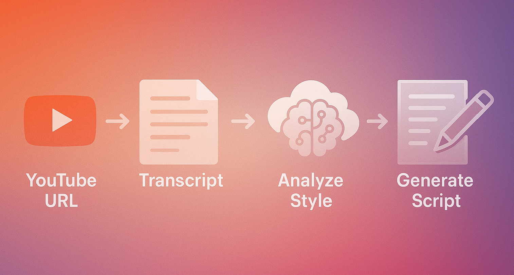

# Youtube Style Generator 🎬✍️

<div align="center">
    
</div>

## AI-Powered Content Style Analysis and Story Generation System

Creating content that matches a specific YouTube creator's style can be challenging and time-consuming. This project provides an automated solution for analyzing, extracting, and mimicking the writing and storytelling style of any YouTube content creator through their video transcripts.

See example generations <u>[here](https://github.com/kevinjin21/AIMLProjects/tree/main/Youtube%20Style%20Generator)</u>

## 📌 Project Overview
**Goal:** Automatically analyze YouTube video transcripts to extract writing style patterns and generate new content in the same style. Allow the user to add user-specified elements (character, plot, etc.) to the new generation.

<div align="center">
    
</div>

### 🚀 Features:
* **YouTube Transcript Extraction**: Pulls transcripts directly from YouTube videos (textfile transcripts also optionally handled)
* **Intelligent Text Chunking**: Breaks down transcripts into manageable pieces for analysis
* **Style Pattern Recognition**: Identifies narrative structure, stylistic elements, and formatting patterns
* **Format Guide Generation**: Creates comprehensive style guides from analyzed content
* **Claude 3.5 Sonnet Integration**: Uses Claude 3.5 Sonnet, a state-of-the-art LLM, for analysis and generation
* **Custom Story Generation**: Creates new stories matching the analyzed style with user-specified elements
* **Markdown Export**: Saves generated stories and format guides for easy sharing

## 🏗️ Technical Implementation

The system uses a combination of technologies to deliver its functionality:

* **Transcript Processing**: YoutubeLoader from LangChain for transcript extraction
* **Text Analysis**: Claude 3.5 Sonnet LLM for deep literary analysis
* **Style Extraction**: Multi-stage prompt engineering to identify writing patterns
* **Content Generation**: Targeted prompting with Claude 3.5 Sonnet for high-quality story creation
* **Data Storage**: Organized file system for saving generated content

## 📁 Project Structure
```
youtube_style_generator/
├── youtube_style_generator.py   # Main application script
├── requirements.txt             # Project dependencies
├── .env                         # Environment variables (API keys)
├── README.md                    # Project documentation
├── formats/                     # Previously generated story formats (can be re-used with new templates)
├── story_templates.yaml         # Example story templates for new generations 
├── transcripts/                 # Text files of Youtube transcripts (optionally used in place of URLs)
├── generations/                 # Youtube stylized generation outputs
└── graphics/                    # Project images and diagrams
```

## 📖 Usage

```bash
# Install dependencies
pip install -r requirements.txt

# Set up environment variables (API keys)
# Create a .env file with your ANTHROPIC_API_KEY

# Run the generator
python youtube_style_generator.py

# Note: you must have an Anthropic API key to use Claude 3.5 Sonnet
```

## ⚗️ Workflow

1. YouTube video transcript is extracted and chunked
2. Each chunk is analyzed for literary style elements
3. Analysis results are consolidated into a comprehensive format guide
4. User provides story elements (characters, setting, theme)
5. New content is generated following the extracted style
6. Generated stories are saved as markdown files

## 💭 Style Elements Analyzed

The system analyzes multiple aspects of writing style:

* **Narrative Structure**: Scene structure, story progression, transitions
* **Stylistic Elements**: Sentence structure, vocabulary, literary devices, tone
* **Character Presentation**: Introduction methods, descriptions, dialogue style
* **Setting & Description**: Environment establishment, description/action balance
* **Dialogue Patterns**: Tag usage, conversation formatting
* **Unique Formatting Elements**: Special formatting, section breaks, recurring themes

## 🤖 LLM Integration

Style analysis and content generation is powered by Claude 3.5 Sonnet:

* Implementation leveraging the Anthropic API via LangChain
* Multi-stage prompt engineering for precise style extraction
* Format-guided generation for consistent style matching
* User-specified story elements for customized content
* Temperature controls for creative yet consistent outputs

## 🎯 Future Enhancements

* Web interface for easier interaction
* Multiple transcript sources for more robust style analysis (currently supports one URL at a time)
* Style comparison between different creators
* Fine-tuning options for more precise style matching
* Audio narration generation in creator's voice style
* Optimizing LLM usage by leveraging conversational model instead of one-shot prompting

*NOTE*: Original structure was built with a one-shot LLM, meaning that improvements and generation could NOT be done iteratively within a single conversation. Instead, formatting and prompts are generated, sent back, improved, and fed into the LLM as a one-shot generation task. This is inefficient and can be improved by using stronger models.

---

*Version 1.0 - AI-powered YouTube style analysis and story generation*
